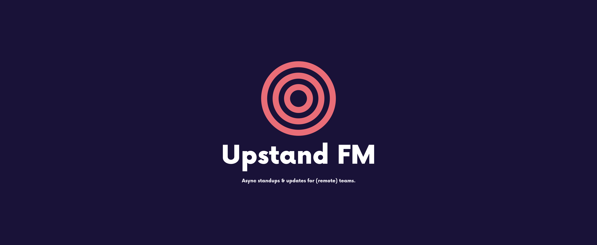

# Design assets

Logo's and stuff 🎨.

The colors and logo have been generated with [Namecheap Logomaker](https://www.namecheap.com/logo-maker/app/):

- Font name: [Now-Black](https://hanken.co/product/now/) by [Hanken Design Co](https://hanken.co)
- Logo designer: Sylvain A

## Colors

- Background color is **dark purple**: `#4a308d`
- Logo color is **coral**: `#e96d77`

## Logo

It combines the concepts of a "record button" and "broadcasting waves".

## SVGs

Multiple variations of logo/name/tagline are available:

- [Logo and name below each other](./logo-name-below)
- [Logo and name beside each other](./logo-name-side)
- [Logo, name and tagline below each other](./logo-name-tagline)
